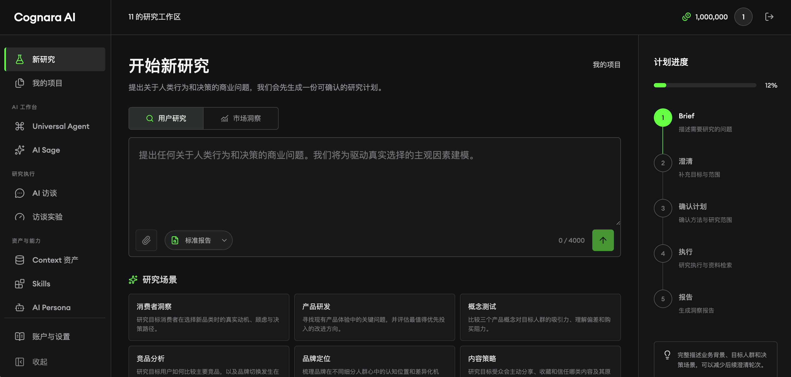
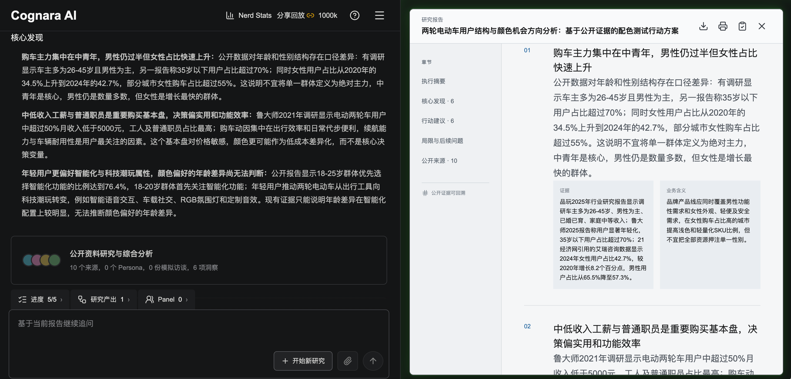
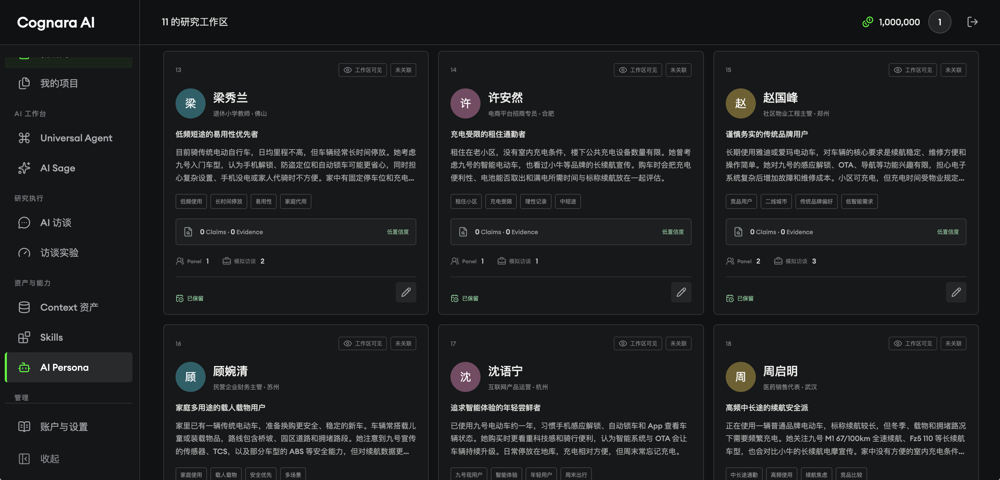
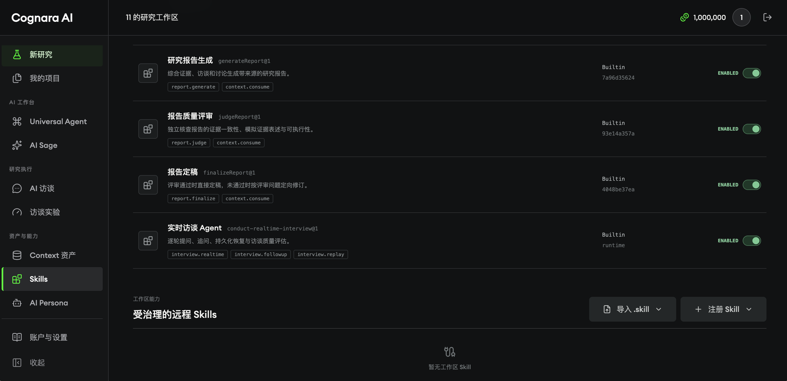
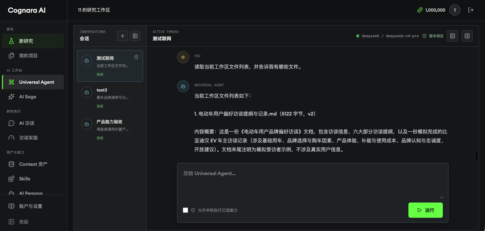

# AI User Research & Agent Platform

[中文](README.md) | [English](README.en.md)

> Start with a research question. Get an evidence-grounded, explainable result that can be reviewed and continued.

This repository contains an AI user-research workspace for product managers, researchers, and AI application developers. A user submits a research goal, reviews the generated plan, and then lets the system coordinate public-web research, Persona and interview analysis, evidence collection, and report generation. Progress, sources, and execution events remain available throughout the run, including after an interruption.

The project is designed around a practical AI application problem: turning unreliable model calls into a product workflow that is observable, recoverable, and auditable—not just a one-shot prompt demo.

## What can you use it for?

| Scenario | Start with | Get |
| --- | --- | --- |
| Consumer insight | A user behavior or purchase-decision question | Market context, user scenarios, findings, and follow-up questions |
| Product research | A product hypothesis to validate | A research plan, Persona/Panel, interview analysis, and actions |
| Competitive or market analysis | A category, platform, or competitor direction | Sourced observations, differences, and explicit limitations |
| Agent workspace | A natural-language task | Permission- and budget-constrained tool calls, files, and run history |

## The product in three steps

1. **Submit a Brief** — describe the research question, audience, scope, and expected output.
2. **Review the plan** — the system creates a reviewable Intent + Plan before consuming research resources.
3. **Inspect the result** — tasks run asynchronously; the UI streams progress while reports, sources, evidence, and events remain replayable.

## Product interface

The screenshots below cover the core workspace: research creation, evidence-backed reports, Persona assets, Skill governance, and Universal Agent execution.

<p align="center">
  
  
</p>
<p align="center"><sub>Research entry and plan confirmation&nbsp;&nbsp;·&nbsp;&nbsp;A report with source and evidence explanations</sub></p>

<p align="center">
  
  
</p>
<p align="center"><sub>Reusable Persona assets&nbsp;&nbsp;·&nbsp;&nbsp;Built-in Skills and execution governance</sub></p>

<p align="center">
  
</p>
<p align="center"><sub>Structured tool calls for workspace files and research capabilities</sub></p>

## End-to-end workflow

```text
Research question / Brief
          ↓
Clarify objective, audience, scope, and evidence needs
          ↓
Generate and confirm an immutable Intent + Plan
          ↓
Create a Run and materialize dependent tasks into the database queue
          ↓
Worker executes research, Persona, interview, validation, and report tasks
          ↓
Persist source snapshots, Context, Evidence, Artifacts, and events
          ↓
Draft report → evidence/quality review → finalize or revise against existing evidence
          ↓
SSE progress updates + database-backed replay
```

## Implemented capabilities

For users, this is a workspace that connects a research question to a traceable conclusion. For engineers and interviewers, it is a complete AI application backend rather than a single model call.

| Area | Capability | Key implementation |
| --- | --- | --- |
| AI research | Planning, clarification, public-web research, Personas, Panels, AI/human interviews, and reports | `src/lib/research-harness.ts`, `src/lib/interviews.ts` |
| Durable runtime | Dependency-ready DAG waves, database queue, worker leases, idempotency, checkpoints, retries, cancellation, and `waiting_input` | `src/lib/task-recovery.ts`, `scripts/research-worker.mjs` |
| Evidence chain | Source candidates, content snapshots and hashes, Evidence/Claim links, citations, and report quality gates | `src/lib/evidence-graph.ts`, `src/lib/report-evidence.ts` |
| Context / RAG | Versioned assets, chunks, hybrid retrieval, retrieval snapshots, memory policies, and evaluation sets | `src/lib/context-system.ts` |
| Universal Agent | Structured actions, product tools, dynamic tasks, files, event streams, run retry, and audit history | `src/lib/universal-agent.ts`, `src/lib/universal-agent-product-tools.ts` |
| Skill Gateway | Skill manifests and versions, capability grants, approval/revocation, immutable Run Bindings, HTTP/MCP executors | `src/lib/skill-gateway.ts`, `src/lib/skill-executor.ts` |
| Sandbox Runner | One-shot JavaScript/Python containers, non-root execution, read-only root filesystem, resource limits, default-deny networking, metrics, and graceful shutdown | `services/sandbox-runner/` |
| Platform access | Workspace isolation, API keys, stateless MCP, cross-workspace publishing/delegation, and provider routing | `src/lib/platform-control.ts`, `src/app/api/v1/` |

## Why the engineering is interesting

AI products become difficult to operate when calls are slow, outputs are uncertain, and users need to understand what happened. This project addresses those concerns in one replayable workflow:

| Problem | Design | Result |
| --- | --- | --- |
| Model calls are slow or fail | APIs create/control work; workers claim database jobs with renewable leases | Web requests stay responsive and interrupted work can be recovered |
| Retries can duplicate side effects | Stable idempotency keys plus request hashes, invocations, and artifacts | Network retries do not silently create a second result |
| Reports need to be trustworthy | Only directly collected public content becomes Evidence; claims link back to sources and pass an independent judge | Findings remain reviewable and revisions cannot invent new facts |
| Agents can overreach | The model proposes structured actions; the server re-checks tool allowlists, Zod schemas, workspace permissions, budgets, and task limits | The model cannot write arbitrary SQL or bypass confirmation |
| Browsers disconnect | Database events are the source of truth; SSE provides live delivery and cursor-based recovery | Live UX is decoupled from the durable run record |
| User code is untrusted | Versioned Skills and capability grants dispatch code to an isolated Runner | The web process never evaluates uploaded code; networking is disabled by default |

## Architecture

```text
Browser / API clients / MCP
              │
              ▼
      Next.js App Router
   Auth · Workspace · API
              │
              ▼
       Intent + Policy
              │
              ▼
   Durable Research Runtime
   DAG · Queue · Lease · Retry
   Checkpoint · Cancel · SSE
       │        │         │
       ▼        ▼         ▼
  Provider   Context    Skill Gateway ──► Sandbox Runner
  Routing    / RAG      HTTP/MCP/Code       Docker/Podman
       \        │         /
        \       ▼        /
          PostgreSQL / Supabase
   studies · runs · tasks · events
   sources · evidence · reports
   skills · context · agent runs
```

The core runtime rule is: **the database stores facts, the model proposes, and the Harness decides whether to execute**. Plans, workflows, Skills, Context retrieval, and provider metadata are versioned for replay and experiment comparison.

## Project context and boundaries

This repository is a clean-room reconstruction based on surviving public website artifacts, page materials, and product clues. The original private backend, production data, and provider configuration are not included; this repository demonstrates a runnable engineering reconstruction, not a line-by-line recovery of a private system.

The following boundaries are intentional:

- AI Personas and simulated interviews explore hypotheses; they are **not real-user samples, population proportions, or causal evidence**.
- The current implementation combines a research-specific runtime with controlled Agent and Market Insight workflows; it does not claim that every business line is already a universal orchestration platform.
- Production operation still requires external services: PostgreSQL/Supabase, model providers, search/object storage, a separate worker, and the Sandbox Runner.
- The repository does not claim unverified QPS, cost, or accuracy numbers. Runs record tokens, latency, retries, quality reviews, and experiment replay data instead.

## Technology stack

- **Web**: Next.js 16 App Router, React 19, TypeScript, Tailwind CSS 4
- **Data**: PostgreSQL / Supabase, `pg`, versioned SQL migrations
- **AI**: OpenAI-compatible APIs, DeepSeek, structured JSON output, Zod runtime validation
- **Runtime**: Durable database jobs, DAG waves, leases, checkpoints, SSE, and recoverable workers
- **Integration**: Public-web connectors, MCP, workspace-scoped API keys, and object-storage adapters
- **Security**: Workspace authorization, opaque public IDs, rate limits, and capability grants
- **Isolation**: Docker / rootless Podman and an independent Sandbox Runner

## Run locally

### Requirements

- Node.js 20+
- pnpm 11+
- PostgreSQL 16+ (or Supabase)
- Docker or rootless Podman for Sandbox Skills

### Start the web app

```bash
cp .env.example .env.local
pnpm install
pnpm dev
```

Configure at least the following in `.env.local`:

- `DATABASE_URL` and `DATABASE_SSL_MODE`
- `NEXT_PUBLIC_SUPABASE_URL` and `NEXT_PUBLIC_SUPABASE_PUBLISHABLE_KEY`
- One model provider, such as `DEEPSEEK_API_KEY` or `OPENAI_API_KEY`

Apply the complete migration chain under `supabase/migrations/` using your deployment workflow. Then open [http://localhost:3000](http://localhost:3000) and register a local account.

### Start the worker

Long-running research and Universal Agent requests are executed by a separate worker:

```bash
pnpm research:worker
```

### Start the Sandbox Runner (optional)

```bash
docker pull node:24-alpine
docker pull python:3.13-alpine
SANDBOX_RUNNER_AUTH_TOKEN='replace-with-at-least-24-characters' pnpm sandbox:runner
```

See [`services/sandbox-runner/README.md`](services/sandbox-runner/README.md) for the runtime contract, readiness checks, metrics, production deployment, and fault drills.

## Verification

Minimal checks:

```bash
pnpm lint
pnpm build
```

The repository also includes smoke tests for report generation, provider routing, task recovery, Context/RAG, Evidence Graph, realtime interviews, Universal Agent, Skill governance, and the Sandbox Runner. See [`package.json`](package.json) for the full command list. Database-isolated smoke tests use `LOCAL_SMOKE_DATABASE_URL` pointing to a local PostgreSQL instance.

GitHub Actions runs TypeScript checks, lint, an isolated Universal Agent smoke test, and a Next.js build for relevant changes. See [`.github/workflows/universal-agent.yml`](.github/workflows/universal-agent.yml).

## Where to read the implementation

1. [`src/lib/research-harness.ts`](src/lib/research-harness.ts) — research tools, task planning, report gates, and the execution path.
2. [`src/lib/task-recovery.ts`](src/lib/task-recovery.ts) — error classification, idempotency, lease recovery, retries, and waiting for input.
3. [`scripts/research-worker.mjs`](scripts/research-worker.mjs) — queue claiming and worker boundaries.
4. [`src/lib/context-system.ts`](src/lib/context-system.ts) — Context versions, retrieval, and retrieval snapshots.
5. [`src/lib/evidence-graph.ts`](src/lib/evidence-graph.ts) — relationships between sources, evidence, claims, and report nodes.
6. [`src/lib/universal-agent.ts`](src/lib/universal-agent.ts) — the Agent action protocol, tool calls, and run lifecycle.
7. [`services/sandbox-runner/`](services/sandbox-runner/) — isolated execution for untrusted Skills.

Additional architecture and deployment notes are available in [`recovery/ARCHITECTURE_RECOVERY.md`](recovery/ARCHITECTURE_RECOVERY.md) and [`services/sandbox-runner/README.md`](services/sandbox-runner/README.md).
