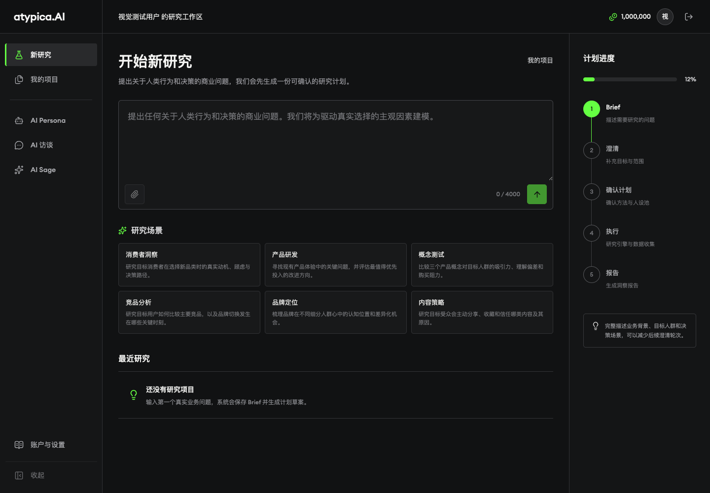
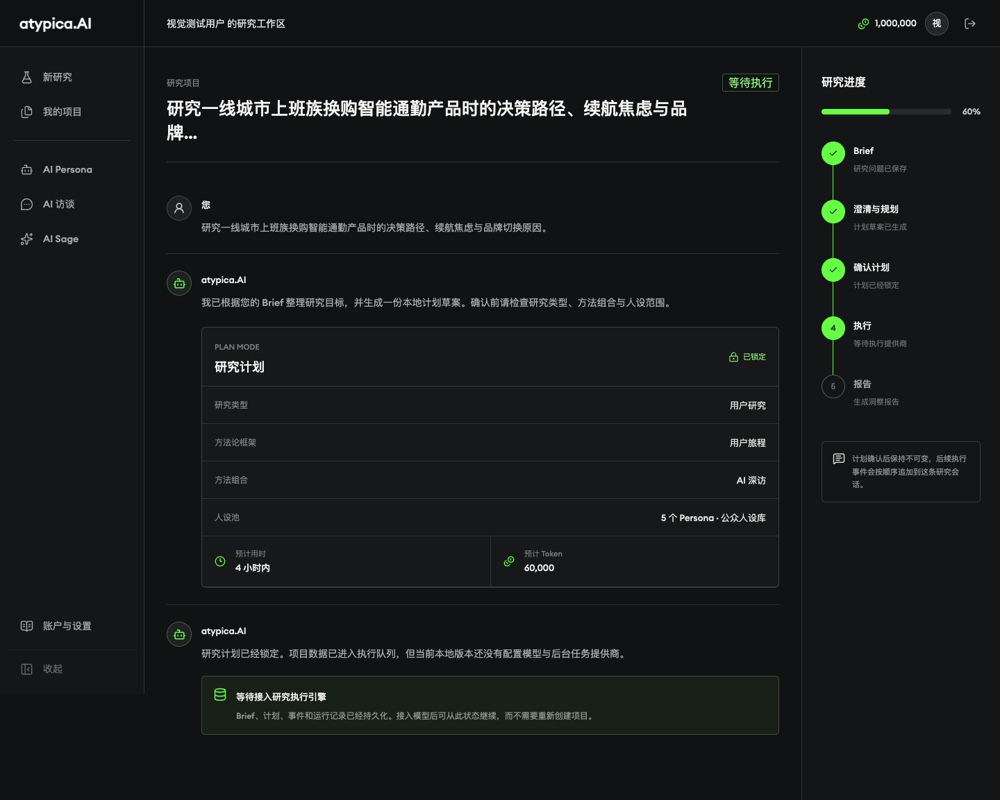

# GEA · AI 用户研究与智能体平台

> 将一个开放式研究问题，转化为可确认、可恢复、可审计的研究流程。

GEA 是一个面向用户研究的 AI Agent 平台：用户提交研究目标后，系统会先生成研究计划，待确认后再执行公开资料检索、Persona 构建、模拟访谈、证据整理和研究报告生成。每一步都有持久化状态、来源和事件记录，长时间任务可以排队、并行、重试、暂停和恢复。

从工程角度看，这个项目重点解决的不是“如何调用一次大模型”，而是如何把不稳定的模型调用组织成一套可运行、可解释、可回放的产品系统。

> **English summary**: GEA is an AI user-research and agent platform built around durable workflows, evidence-grounded reports, governed tool calling, and isolated Skill execution.

## 项目背景

本仓库是基于幸存的公开网站、页面素材和产品线索进行的 clean-room reconstruction。原项目的私有后端、生产数据和 Provider 配置不在仓库中；因此这里展示的是一套可运行的工程恢复与架构实现，而不是对原私有系统的逐行还原。

## 产品流程

```text
研究问题 / Brief
      ↓
澄清目标、受众、范围和证据需求
      ↓
生成并确认 Intent + Plan（不可变版本）
      ↓
创建 Run，物化依赖任务图并写入数据库队列
      ↓
Worker 执行检索、Persona、访谈、验证和报告任务
      ↓
保存来源快照、Context、Evidence、Artifact 和事件
      ↓
报告初稿 → 证据/质量评审 → 通过定稿或基于现有证据定向修订
      ↓
SSE 实时进度 + 数据库回放
```





## 已实现能力

| 模块 | 能力 | 关键实现 |
| --- | --- | --- |
| AI 用户研究 | 研究计划、澄清、公开网页研究、Persona、Panel、AI/真人访谈、报告 | `src/lib/research-harness.ts`、`src/lib/interviews.ts` |
| Durable Runtime | 依赖就绪的 DAG wave、数据库队列、Worker lease、幂等、checkpoint、重试、取消、`waiting_input` | `src/lib/task-recovery.ts`、`scripts/research-worker.mjs` |
| 证据链 | 来源候选、正文快照与 hash、Evidence/Claim 关系、报告引用和质量 gate | `src/lib/evidence-graph.ts`、`src/lib/report-evidence.ts` |
| Context / RAG | 版本化资产、chunks、混合检索、retrieval snapshot、记忆策略和评估集 | `src/lib/context-system.ts` |
| Universal Agent | 结构化动作、产品工具、动态任务、文件、事件流、run retry 和审计 | `src/lib/universal-agent.ts`、`src/lib/universal-agent-product-tools.ts` |
| Skill Gateway | Skill manifest/version、能力授权、审批/撤销、不可变 Run Binding、HTTP/MCP executor | `src/lib/skill-gateway.ts`、`src/lib/skill-executor.ts` |
| Sandbox Runner | JavaScript/Python 一次性容器执行、非 root、只读 rootfs、资源限制、默认禁网、metrics 和优雅退出 | `services/sandbox-runner/` |
| 平台能力 | workspace 隔离、API key、无状态 MCP、跨 workspace 发布/委托、Provider 路由 | `src/lib/platform-control.ts`、`src/app/api/v1/` |

## 值得关注的工程设计

| 问题 | 设计 | 结果 |
| --- | --- | --- |
| 模型调用耗时且可能失败 | API 只创建/控制任务，Worker 从数据库队列领取任务；lease 过期后可接管 | Web 请求不会被长调用阻塞，进程重启后可以继续执行 |
| 重试可能产生重复副作用 | 每个任务使用稳定 idempotency key，并保存请求 hash、invocation 和 artifact | 网络重试不会悄悄生成第二份结果，参数变化会被拒绝 |
| 研究结果需要可信 | 直接公开正文才进入 Evidence；报告结论关联 Claim/Evidence，并经过独立 judge | 结论可以回到来源，证据不足时不会被修订阶段偷偷补事实 |
| Agent 可能越权 | 模型只能提出结构化 action；服务端再次校验工具白名单、Zod schema、workspace 权限、预算和任务上限 | 模型没有直接写数据库或绕过确认的权限 |
| 浏览器断线或 SSE 丢包 | 数据库事件是事实来源，SSE 只负责实时传输，并使用游标补回遗漏事件 | 实时体验和最终一致的运行记录解耦 |
| 用户代码可能影响主服务 | Skill 通过版本和 capability grant 治理，代码交给独立 Runner 的临时容器执行 | Web 进程不执行上传源码，默认关闭网络并限制 CPU、内存、PID、输出和超时 |

## 架构概览

```text
Browser / API clients / MCP
              │
              ▼
      Next.js App Router
   Auth · Workspace · API
              │
              ▼
       Intent + Policy
              │
              ▼
   Durable Research Runtime
   DAG · Queue · Lease · Retry
   Checkpoint · Cancel · SSE
       │        │         │
       ▼        ▼         ▼
  Provider   Context    Skill Gateway ──► Sandbox Runner
  Routing    / RAG      HTTP/MCP/Code       Docker/Podman
       \        │         /
        \       ▼        /
          PostgreSQL / Supabase
   studies · runs · tasks · events
   sources · evidence · reports
   skills · context · agent runs
```

运行时的核心原则是：**数据库保存事实，模型提出建议，Harness 决定是否执行**。研究计划、Workflow、Skill、Context retrieval 和 Provider 元数据都会被版本化，便于回放和比较实验结果。

## 技术栈

- **Web**：Next.js 16 App Router、React 19、TypeScript、Tailwind CSS 4
- **Data**：PostgreSQL / Supabase、`pg`、版本化 SQL migrations
- **AI**：OpenAI-compatible API、DeepSeek、结构化 JSON 输出、Zod runtime validation
- **Runtime**：数据库任务队列、DAG wave、lease、checkpoint、SSE、可恢复 Worker
- **Integration**：公开网页连接器、MCP、workspace-scoped API keys、对象存储适配
- **Security**：workspace authorization、opaque public IDs、rate limits、capability grants
- **Execution isolation**：Docker / rootless Podman、独立 Sandbox Runner

## 本地运行

### 环境要求

- Node.js 20+
- pnpm 11+
- PostgreSQL 16+（或 Supabase）
- 运行 Sandbox Skill 时需要 Docker 或 rootless Podman

### 启动 Web

```bash
cp .env.example .env.local
pnpm install
pnpm dev
```

在 `.env.local` 中配置至少以下内容：

- `DATABASE_URL` 和 `DATABASE_SSL_MODE`
- `NEXT_PUBLIC_SUPABASE_URL`、`NEXT_PUBLIC_SUPABASE_PUBLISHABLE_KEY`
- 一个可用的模型 Provider（例如 `DEEPSEEK_API_KEY` 或 `OPENAI_API_KEY`）

首次启动前，请按部署平台执行 `supabase/migrations/` 中的完整迁移链。然后访问 [http://localhost:3000](http://localhost:3000)，注册本地账号即可进入工作区。

### 启动 Worker

研究任务和 Universal Agent 请求由独立 Worker 执行：

```bash
pnpm research:worker
```

本地开发时，研究确认流程会尝试唤醒一个任务；Universal Agent 和生产环境的长任务仍建议单独运行 Worker。

### 启动 Sandbox Runner（可选）

```bash
docker pull node:24-alpine
docker pull python:3.13-alpine
SANDBOX_RUNNER_AUTH_TOKEN='replace-with-at-least-24-characters' pnpm sandbox:runner
```

Runner 的运行契约、生产部署、readiness、metrics 和故障演练见 [`services/sandbox-runner/README.md`](services/sandbox-runner/README.md)。生产环境应使用独立 Linux 主机、HTTPS、固定镜像 digest 和 rootless runtime。

## 验证

最小验证：

```bash
pnpm lint
pnpm build
```

仓库还提供针对研究报告、Provider 路由、任务恢复、Context/RAG、Evidence Graph、Realtime Interview、Universal Agent、Skill governance 和 Sandbox Runner 的 smoke tests。完整命令见 [`package.json`](package.json)；依赖数据库的隔离测试使用 `LOCAL_SMOKE_DATABASE_URL` 指向本机 PostgreSQL，避免写入远程生产库。

GitHub Actions 会在 Universal Agent 相关变更上运行 TypeScript 检查、lint、隔离 smoke test 和 Next.js build，配置见 [`.github/workflows/universal-agent.yml`](.github/workflows/universal-agent.yml)。

## 建议阅读顺序

如果你想快速理解核心实现，可以按下面顺序阅读：

1. [`src/lib/research-harness.ts`](src/lib/research-harness.ts)：研究工具、任务计划、报告 gate 和执行主线。
2. [`src/lib/task-recovery.ts`](src/lib/task-recovery.ts)：错误分类、幂等、lease 恢复、重试和等待输入。
3. [`scripts/research-worker.mjs`](scripts/research-worker.mjs)：队列 Worker 的领取与执行边界。
4. [`src/lib/context-system.ts`](src/lib/context-system.ts)：Context 版本、检索和 retrieval snapshot。
5. [`src/lib/evidence-graph.ts`](src/lib/evidence-graph.ts)：来源、证据、结论和报告节点的关系。
6. [`src/lib/universal-agent.ts`](src/lib/universal-agent.ts)：Agent action protocol、工具调用和 run 生命周期。
7. [`services/sandbox-runner/`](services/sandbox-runner/)：不可信 Skill 的隔离执行。

更完整的系统边界、恢复依据和架构说明见 [`recovery/ARCHITECTURE_RECOVERY.md`](recovery/ARCHITECTURE_RECOVERY.md)；产品部署与运行细节见 [`services/sandbox-runner/README.md`](services/sandbox-runner/README.md)。

## 诚实的边界

- AI Persona 和模拟访谈用于探索假设，**不能当作真实用户样本、真实比例或因果证据**。
- 当前实现是研究产品专用 Runtime 加受控的 Agent/Market Insight workflow，不宣称所有业务线都已经抽象成通用编排平台。
- 生产运行仍需要外部配置：PostgreSQL/Supabase、模型 Provider、搜索/对象存储、独立 Worker 和 Sandbox Runner。
- 仓库没有未经验证的 QPS、成本或准确率数字；相关指标通过 run、token、延迟、重试、质量评审和实验回放记录。
- 原项目私有后端、历史数据库、真实 Prompt、训练数据和生产部署拓扑无法从公开资料确定，也没有被伪装成已还原事实。

这也是项目希望展示的重点：把模型能力放进明确的状态、权限、证据和恢复边界里，让 AI 功能从一次性 Demo 变成可以运行、观察、复查和迭代的系统。
